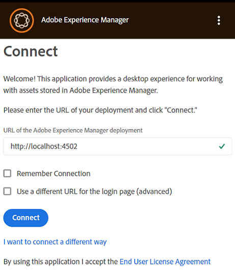
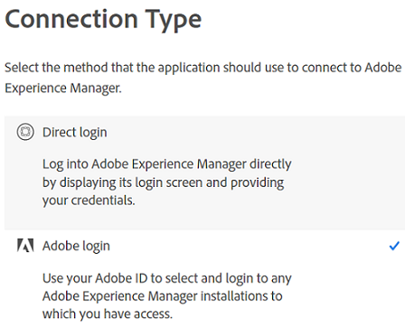
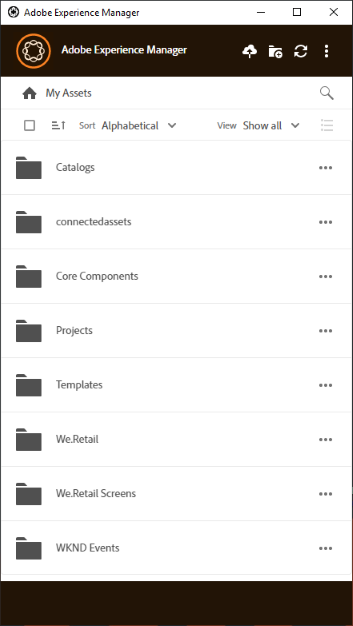

# Instalar [!DNL Adobe Experience Manager] aplicativo de desktop {#install-app-v2}

Usar o [!DNL Adobe Experience Manager] aplicativo de desktop, os ativos dentro do [!DNL Experience Manager] estão facilmente disponíveis no desktop local e podem ser usados em qualquer aplicativo de desktop nativo. Os ativos podem ser visualizados, abertos em aplicativos de desktop nativos, revelados no Mac Finder ou no Windows Explorer para serem inseridos em outros documentos e alterados localmente — as alterações são salvas novamente em [!DNL Experience Manager] quando você faz upload e uma nova versão é criada no repositório.

Essa integração permite que várias funções na organização:

* Gerenciar os ativos de maneira central no [!DNL Experience Manager Assets].

* Acesse os ativos em qualquer aplicativo de desktop nativo, incluindo aplicativos de terceiros e no Adobe Creative Cloud. Ao fazer isso, os usuários podem facilmente aderir aos vários padrões, incluindo a marca.

Para usar [!DNL Experience Manager] aplicativo de desktop:

* Verifique se [!DNL Experience Manager] A versão é compatível com o [!DNL Experience Manager] aplicativo de desktop. Consulte a [requisitos do sistema](release-notes.md).

* Baixe e instale o aplicativo. Consulte [instalar aplicativo de desktop](#install-v2) abaixo.

* Teste a conexão usando alguns ativos. Consulte [como procurar e pesquisar ativos](using.md#browse-search-preview-assets).

## Requisitos do sistema, pré-requisitos e links de download {#tech-specs-v2}

Para obter informações detalhadas, consulte [[!DNL Experience Manager] notas de versão do aplicativo para desktop](release-notes.md).

## Atualizar de uma versão anterior {#upgrade-from-previous-version}

Se você for um usuário da v1.x do aplicativo de desktop, entenda as diferenças e semelhanças entre a versão anterior e a mais recente do aplicativo. Consulte [novidades no aplicativo de desktop](introduction.md#whats-new-v2) e [como o aplicativo funciona](release-notes.md#how-app-works).

>[!NOTE]
>
>Duas versões do aplicativo de desktop não podem coexistir em um computador. Antes de instalar uma versão, desinstale a outra versão.

Para atualizar de uma versão anterior do aplicativo, siga estas instruções:

1. Antes de atualizar, sincronize todos os ativos e faça upload das alterações no [!DNL Experience Manager]. Isso evita a perda de edições ao desinstalar o aplicativo.

1. Desinstale a versão anterior do aplicativo. Ao desinstalar, selecione a opção para limpar o cache.

1. Reinicie o computador.

1. [Baixar](release-notes.md) e [instalar](#install-v2) o aplicativo mais recente. Siga as instruções abaixo.

## Instalar {#install-v2}

Para instalar o aplicativo de desktop, siga estas etapas. Desinstale qualquer Adobe existente [!DNL Experience Manager] aplicativo de desktop v1.x antes de instalar o aplicativo mais recente. Para obter mais informações, consulte acima.

1. Baixe o instalador mais recente do [notas de versão](release-notes.md) página.

1. Mantenha o URL e as credenciais do seu [!DNL Experience Manager] implantação útil.

1. Se estiver atualizando de outra versão do aplicativo, consulte [atualizar aplicativo de desktop](#upgrade-from-previous-version).

1. Pule esta etapa se estiver usando [!DNL Experience Manager] as a [!DNL Cloud Service], [!DNL Experience Manager] 6.4.4 ou posterior, ou [!DNL Experience Manager] 6.5.0 ou posterior. Verifique se [!DNL Experience Manager] a configuração atende aos requisitos de compatibilidade mencionados na [notas de versão](release-notes.md). Se necessário, baixe o arquivo [pacote de compatibilidade](https://experience.adobe.com/#/downloads/content/software-distribution/en/aem.html?package=/content/software-distribution/en/details.html/content/dam/aem/public/adobe/packages/cq640/featurepack/adobe-asset-link-support) e instale-o usando o [!DNL Experience Manager] Gerenciador de pacotes como um [!DNL Experience Manager] administrador. Para instalar um pacote, consulte [Como trabalhar com pacotes](https://experienceleague.adobe.com/docs/experience-manager-65/administering/contentmanagement/package-manager.html?lang=pt-BR).

1. Execute o binário do instalador e siga as instruções na tela para instalar o.

1. No Windows, o instalador pode solicitar a instalação `Visual Studio C++ Redistributable 2015`. Siga as instruções na tela para instalá-lo. Se a instalação falhar, instale-a manualmente. Baixe o instalador de [aqui](https://www.microsoft.com/en-us/download/details.aspx?id=52685) e instalar ambos `vc_redist.x64.exe` e `vc_redist.x86.exe` arquivos. Execute novamente a [!DNL Experience Manager] instalador do aplicativo de desktop.

1. Reinicie a máquina conforme solicitado. Inicie e configure o aplicativo de desktop.

1. Para conectar o aplicativo com um [!DNL Experience Manager] repositório, clique no ícone do aplicativo na bandeja e inicie o aplicativo. Forneça o endereço do [!DNL Experience Manager] servidor no formato `https://[aem_server]:[port]/`.

   Clique em **[!UICONTROL Connect]** e forneça as credenciais.

   

   *Figura: Tela de conexão para o endereço do servidor de entrada.*

   Selecionar **[!UICONTROL Remember Connection]** para evitar inserir os detalhes da conexão sempre que fizer logon no aplicativo de desktop.

   >[!CAUTION]
   >
   >Verifique se não há espaços à esquerda ou à direita antes ou depois do endereço do [!DNL Experience Manager] servidor. Caso contrário, o aplicativo não poderá se conectar à [!DNL Experience Manager] servidor.

1. Clique em **[!UICONTROL I want to connect a different way]** e clique em **[!UICONTROL Adobe login]** para fazer logon no servidor do Experience Manager Assets usando o Adobe Identity Management Service (IMS). O logon IMS permite que o aplicativo de desktop execute a atualização do token de acesso automaticamente, permitindo que o usuário permaneça conectado por até 14 dias. Clique em **[!UICONTROL Direct login]** para fazer logon na [!DNL Experience Manager] servidor usando as credenciais.

   

1. Após a conexão bem-sucedida, é possível visualizar a lista de pastas e ativos disponíveis na pasta raiz do [!DNL Experience Manager] DAM. Você pode navegar pelas pastas de dentro do aplicativo.

   

   *Figura: o aplicativo exibe o conteúdo do DAM após o logon*

1. ([!DNL Experience Manager] 6.5.1 ou posterior) Se estiver usando um aplicativo de desktop com [!DNL Experience Manager] 6.5.1 ou posterior, atualize o conector S3 ou Azure para a versão 1.10.4 ou posterior. Consulte [Conector do Azure](https://experienceleague.adobe.com/docs/experience-manager-65/deploying/deploying/data-store-config.html#azure-data-store) ou [Conector S3](https://experienceleague.adobe.com/docs/experience-manager-65/deploying/deploying/data-store-config.html#amazon-s-data-store).

   Se você for um cliente do Adobe Managed Services (AMS), entre em contato com o Suporte ao cliente da Adobe.

## Definir preferências {#set-preferences}

Para alterar as preferências, clique em  e **[!UICONTROL Preference]** . No **[!UICONTROL Preferences]** ajuste os valores do seguinte:

* [!UICONTROL Launch application on login].

* [!UICONTROL Show window when application starts].

* **[!UICONTROL Cache Directory]**: Local do cache local do aplicativo (contém os ativos baixados localmente).

* **[!UICONTROL Network Drive Letter]**: a letra de unidade usada para mapear para a variável [!DNL Experience Manager] DAM. Não altere se não tiver certeza. O aplicativo pode mapear para qualquer letra de unidade no Windows. Se dois usuários colocarem ativos de letras de unidade diferentes, eles não poderão ver os ativos colocados um pelo outro. O caminho dos ativos muda. Os ativos permanecem colocados no arquivo binário (digamos INDD) e não são removidos. O aplicativo lista todas as letras de unidade disponíveis e, por padrão, usa a última letra disponível que normalmente é `Z`.

* **[!UICONTROL Maximum Cache Size]**: cache permitido no disco rígido em GB usado para armazenar ativos baixados localmente.

* **[!UICONTROL Current cache size]**: tamanho de armazenamento dos ativos baixados localmente. As informações são exibidas somente após o download dos ativos usando o aplicativo.

* **[!UICONTROL Automatically download linked assets]**: os ativos colocados nos aplicativos Creative Cloud nativos compatíveis serão buscados automaticamente se você baixar o arquivo original.

* **[!UICONTROL Maximum number of downloads]**:  Altere com cuidado. Ao baixar ativos pela primeira vez (por meio da opção Revelar, Abrir, Editar, Baixar ou semelhante), os ativos serão baixados somente se o lote contiver menos que esse número. O valor padrão é 50. Não altere se não tiver certeza. O aumento do valor pode resultar em tempos de espera mais longos. A diminuição do valor pode não permitir o download dos ativos ou pastas necessários de uma só vez.

* **[!UICONTROL Use legacy conventions when creating nodes for assets and folders]**:  Altere com cuidado. Esta configuração permite que o aplicativo emule o comportamento do aplicativo v1.10 ao carregar pastas. Na v1.10, os nomes de nó criados no repositório respeitam espaços e letras maiúsculas e minúsculas dos nomes de pasta fornecidos pelo usuário. No entanto, na v2.1 do aplicativo, os espaços extras nos nomes de pasta são convertidos em traços. Por exemplo, carregando `New Folder` ou `new   folder` O cria o mesmo nó no repositório se a opção não estiver selecionada e o comportamento padrão na v2.1 for retido. Se essa opção estiver selecionada, nós diferentes serão criados no repositório para as duas pastas acima e ele corresponderá ao comportamento do aplicativo v1.10.

  O comportamento padrão da v2.1 continua sendo o mesmo, ou seja, substitui vários espaços em nomes de pastas por traços no nome do nó do repositório e converte para nomes de nó em minúsculas.

* **[!UICONTROL Upload Acceleration]**:  Altere com cuidado. Ao fazer upload de ativos, o aplicativo pode usar uploads simultâneos para melhorar a velocidade de upload. Você pode aumentar a simultaneidade do upload movendo o controle deslizante para a direita. O controle deslizante no lado esquerdo distante significa que não há simultaneidade (upload de segmento único), a posição intermediária corresponde a 10 threads simultâneos e o limite máximo no lado direito distante corresponde a 20 threads simultâneos. Um limite de simultaneidade mais alto consome mais recursos.

Para atualizar as preferências indisponíveis, faça logout do [!DNL Experience Manager] e atualize. Depois de atualizar as preferências, clique em .


*Figura: Preferências do aplicativo de desktop.*

### Suporte de proxy {#proxy-support}

[!DNL Experience Manager] O aplicativo de desktop usa o proxy predefinido do sistema para se conectar à Internet via HTTPS. O aplicativo só pode se conectar usando um proxy de rede que não exija autenticação extra.

Se você definir ou modificar as configurações do servidor proxy para o Windows (Opções da Internet > Configurações da LAN), reinicie o [!DNL Experience Manager] aplicativo de desktop para que as alterações entrem em vigor. A configuração de proxy se aplica ao iniciar o aplicativo de desktop. Feche e reinicie o aplicativo para que as alterações entrem em vigor.

Se o proxy exigir autenticação, a equipe de TI poderá permitir que o [!DNL Experience Manager Assets] URL nas configurações do servidor proxy para permitir a passagem do tráfego do aplicativo.

## Desinstalar o aplicativo {#uninstall-the-app}

Para desinstalar o aplicativo no Windows, siga estas etapas:

1. Fazer upload de todas as alterações para [!DNL Experience Manager] para evitar a perda de edições. Consulte [Editar ativos e carregar ativos atualizados para [!DNL Experience Manager]](using.md#edit-assets-upload-updated-assets). Fazer logoff e [!UICONTROL Exit] o aplicativo.

1. Remova o aplicativo como removeria qualquer outro aplicativo do sistema operacional. Desinstale-o em Adicionar e remover programas no Windows.

1. Para remover o cache e os logs, marque a caixa de seleção necessária.

   

1. Siga as instruções na tela. Quando terminar, reinicie o computador.

Para desinstalar o aplicativo no Mac, siga estas etapas:

1. Fazer upload de todas as alterações para [!DNL Experience Manager] para evitar a perda de edições. Consulte [Editar ativos e carregar ativos atualizados para [!DNL Experience Manager]](using.md#edit-assets-upload-updated-assets). Fazer logoff e [!UICONTROL Exit] o aplicativo.

1. Remova o `Adobe Experience Manager Desktop.app` de `/Applications`.

Como alternativa, para limpar os caches de aplicativos internos no Mac e desinstalar o aplicativo, você pode executar o seguinte comando no terminal:

```shell
/Applications/Adobe Experience Manager Desktop/Contents/Resources/uninstall-osx/uninstall.sh
```
