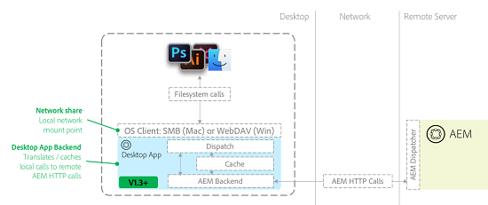

# Solução de problemas [!DNL Adobe Experience Manager] aplicativo de desktop v1.x {#troubleshoot-aem-desktop-app}

Solucione problemas do aplicativo de desktop AEM para resolver problemas ocasionais relacionados à instalação, atualização, configuração e assim por diante.

[!DNL Adobe Experience Manager] O aplicativo de desktop inclui utilitários que ajudam a mapear o repositório do AEM Assets como um compartilhamento de rede no desktop (compartilhamento SMB no sistema operacional Mac). O compartilhamento de rede é uma tecnologia de sistema operacional que permite que fontes remotas sejam tratadas como se fossem parte de um sistema de arquivos local de um computador. No caso do aplicativo de desktop, a estrutura do repositório do gerenciamento de ativos digitais (DAM) de uma instância remota do AEM é direcionada como a fonte de arquivo remota. O diagrama a seguir descreve a topologia do aplicativo de desktop:



Com essa arquitetura, o aplicativo de desktop intercepta chamadas do sistema de arquivos (abertas, fechadas, lidas, gravadas etc.) para o compartilhamento de rede montado e as traduz em chamadas HTTP AEM nativas para o servidor AEM. Os arquivos são armazenados em cache localmente. Para obter mais detalhes, consulte [Usar o aplicativo para desktop AEM v1.x](use-app-v1.md).

## Visão geral do componente de aplicativo para desktop AEM {#desktop-app-component-overview}

o aplicativo de desktop inclui os seguintes componentes:

* **O aplicativo de desktop**: o aplicativo monta ou desmonta o DAM como um sistema de arquivos remoto e traduz as chamadas do sistema de arquivos entre o compartilhamento de rede montado localmente e a instância remota do AEM à qual ele se conecta.
* **Cliente WebDAV/SMB do sistema operacional**: lida com a comunicação entre o Windows Explorer/Finder e o aplicativo de desktop. Se um arquivo for recuperado, criado, modificado, excluído, movido ou copiado, o cliente WebDAV/SMB do sistema operacional comunicará essa operação ao aplicativo de desktop. Depois de receber a comunicação, o aplicativo de desktop a traduz em chamadas de API remotas AEM nativas. Por exemplo, se um usuário criar um arquivo no diretório montado, o cliente WebDAV/SMB iniciará uma solicitação, que o aplicativo de desktop converterá em uma solicitação HTTP que cria o arquivo no DAM. O cliente WebDAV/SMB é um componente integrado do sistema operacional. Ele não é afiliado a aplicativos de desktop, AEM ou Adobe de forma alguma.
* **Instância do Adobe Experience Manager**: fornece acesso aos ativos armazenados no repositório DAM do AEM Assets. Além disso, ele executa ações solicitadas pelo aplicativo de desktop em nome dos aplicativos de desktop locais que interagem com o compartilhamento de rede montado. A instância de AEM de destino deve executar AEM versão 6.1 ou superior. Instâncias do AEM que executam versões anteriores do AEM podem exigir pacotes de recursos extras e hot fixes instalados para se tornarem totalmente funcionais.

## Casos de uso pretendidos para o aplicativo de desktop AEM {#intended-use-cases-for-aem-desktop-app}

O aplicativo de desktop AEM usa a tecnologia de compartilhamento de rede para mapear um repositório AEM remoto para um desktop local. No entanto, não se destina a substituir um compartilhamento de rede que mantém ativos, em que os usuários executam operações de gerenciamento de ativos digitais diretamente do desktop local. Isso inclui mover ou copiar vários arquivos ou arrastar grandes estruturas de pastas para o compartilhamento de rede da AEM Assets diretamente no Finder/Explorer.

O aplicativo de desktop AEM fornece uma maneira conveniente de acessar (abrir) e editar (salvar) ativos DAM entre a interface do usuário de toque do AEM Assets e o desktop local. Ele vincula ativos no servidor do AEM Assets aos fluxos de trabalho com base em desktop.

O exemplo de caso de uso a seguir ilustra como o AEM Desktop deve ser usado:

* Um usuário faz logon no AEM e usa a interface da Web do para localizar um ativo.
* Usando os recursos de ação de desktop da interface da Web do AEM, o usuário abre, exibe ou edita o ativo no desktop conforme necessário.
* O AEM Desktop abre o ativo no editor padrão para o tipo de arquivo do ativo.
* O usuário faz as alterações desejadas no ativo.
* Depois que um arquivo é modificado, o usuário pode visualizar o status de sincronização do arquivo usando a janela de status de sincronização em segundo plano do AEM Desktop.
* Usando o menu de contexto do AEM Desktop, o usuário faz check-in/check-out do ativo ou retorna à interface do usuário do DAM.
* Após concluir as alterações no arquivo, o usuário retorna à interface da Web do AEM

Este não é o único caso de uso. No entanto, ele ilustra como o AEM Desktop é um mecanismo conveniente para acessar/editar ativos localmente. É recomendável usar a interface da Web do DAM o máximo possível, pois ela oferece uma experiência melhor. Adobe Ele oferece mais flexibilidade para atender às necessidades do cliente.

## Limitações {#limitations}

O compartilhamento de rede WebDAV/SMB1 oferece a conveniência de trabalhar com arquivos em uma janela do Explorer/Finder. No entanto, o Explorer/Finder e o AEM se comunicam por uma conexão de rede que tem determinadas limitações. Por exemplo, o tempo gasto para copiar um arquivo de 1 GB para o diretório WebDAV/SMB montado é aproximadamente o mesmo tempo necessário para carregar um arquivo de 1 GB para um site usando um navegador da Web. Na verdade, no primeiro caso, a duração pode ser maior devido a ineficiências do protocolo WebDAV/SMB e dos clientes WebDAV/SMB do sistema operacional (particularmente Mac OS X).

Há limitações para os tipos de tarefas que podem ser executadas a partir de um diretório montado. Em geral, trabalhar com arquivos grandes especialmente em uma conexão de rede de baixa largura de banda/baixa latência/baixa baixa latência pode ser desafiador, especialmente ao editar arquivos grandes.

O Adobe recomenda que você execute alguns testes de caso de uso antes de confirmar para um cliente que determinados tipos de arquivos podem ser editados com eficiência no local a partir do diretório montado.

O AEM Desktop não é adequado para a manipulação intensiva do sistema de arquivos, incluindo, mas não limitado a:

* Mover ou copiar arquivos e diretórios
* Adicionar muitos ativos ao AEM
* Procurar e abrir arquivos por meio do sistema de arquivos, exceto para procurar pastas
* Compactação ou descompactação de arquivos compactados

Devido a limitações no sistema operacional, o Windows tem uma limitação de tamanho de arquivo de 4.294.967.295 bytes (aproximadamente 4,29 GB). Isso se deve a uma configuração do Registro que define o tamanho que um arquivo em um compartilhamento de rede pode ter. O valor da configuração do Registro é um DWORD com um tamanho máximo que é igual ao número referenciado.

[!DNL Experience Manager] o aplicativo de desktop não tem um valor de tempo limite configurável que desconecta a conexão entre [!DNL Experience Manager] aplicativo de servidor e desktop após um intervalo de tempo fixo. Ao fazer upload de ativos grandes, se a conexão atingir o tempo limite após um tempo, o aplicativo tentará fazer upload do ativo algumas vezes, aumentando o tempo limite do upload. Não há uma maneira recomendada de alterar as configurações padrão de tempo limite.

## Armazenamento em cache e comunicação com AEM {#caching-and-communication-with-aem}

O aplicativo de desktop AEM fornece cache interno e recursos de upload em segundo plano para melhorar a experiência do usuário final. Ao salvar um arquivo grande, ele é primeiro salvo localmente para que você continue trabalhando. Após algum tempo (atualmente 30 segundos), o arquivo é enviado ao servidor AEM em segundo plano.

Ao contrário do Creative Cloud Desktop ou de outras soluções de sincronização de arquivos, como o Microsoft One Drive, o aplicativo para desktop AEM não é um cliente de sincronização de desktop completo. O motivo para isso é que ele fornece acesso a todo o repositório do AEM Assets, que pode ser extremamente grande (centenas de gigabytes ou terabytes) para uma sincronização completa.

O armazenamento em cache permite limitar a sobrecarga da rede/armazenamento a apenas um subconjunto de ativos que sejam relevantes para o usuário.

>[!CAUTION]
>
>A Adobe recomenda desativar a geração de miniaturas para agilizar a navegação. Se você habilitar as visualizações de ícones, o aplicativo armazenará em cache os ativos digitais quando você navegar pela pasta montada. O aplicativo também baixa ativos que o usuário pode não se importar, o que adiciona carga ao servidor, consome a largura de banda do usuário e usa mais espaço em disco do usuário.

Veja como o aplicativo para desktop AEM executa o armazenamento em cache:

* Quando você abre uma pasta no Finder e miniaturas/visualizações de arquivos são exibidas, ou quando você abre um arquivo em um aplicativo, o aplicativo de desktop armazena em cache o binário do arquivo.
* Quando você armazena arquivos por meio do Finder ou de outros aplicativos de desktop, o arquivo é armazenado localmente primeiro (em cache) e o sistema operacional é notificado. O arquivo é enfileirado para upload no servidor em segundo plano e, eventualmente, carregado pela rede. No caso de um erro de rede, o aplicativo de desktop tentará fazer upload do arquivo inteiro no máximo três vezes. Se o não for carregado após três tentativas, o arquivo será marcado como conflitante e o status será exibido por meio da janela Status da fila de upload em segundo plano. o aplicativo de desktop não tenta mais atualizar o arquivo. O usuário deve atualizar o arquivo e carregá-lo novamente após a restauração da conectividade

Todas as operações não são armazenadas em cache localmente. Os itens a seguir são transmitidos ao servidor AEM imediatamente, sem armazenamento em cache local:

* Quaisquer operações em pastas, por exemplo, criar, excluir etc.
* O recurso Carregamento de pasta introduzido na versão 1.4 carrega uma hierarquia de pasta local, sem armazenar os arquivos em cache localmente

## Operações individuais {#individual-operations}

Ao solucionar problemas de desempenho sub-otimizado para usuários individuais, revise primeiro [as limitações do aplicativo](#limitations). As seções subsequentes incluem sugestões para melhorar o desempenho dos usuários individuais.

## Recomendações sobre largura de banda {#bandwidth-recommendations}

A largura de banda disponível para um usuário individual desempenha um papel essencial no desempenho do cliente WebDAV/SMB.

A Adobe recomenda que a velocidade de upload de um usuário individual esteja próxima a 10 Mbps. Para conexões sem fio, a largura de banda é frequentemente compartilhada entre vários usuários. Se vários usuários executarem simultaneamente tarefas que consomem largura de banda da rede, o desempenho poderá diminuir ainda mais. Para evitar esses problemas, use uma conexão com fio.

<!-- AG, 8/18: The Windows KB article is removed by MS now. Giving 404. Also, Win 7 support is gone and the desktop app is also not supported on Win 7. Hiding this content for now.

## Windows-specific configurations {#windows-specific-configurations}

If you use Experience Manager on Windows, you can configure Windows to enhance the performance of the WebDAV client. For more information, go to [https://support.microsoft.com/en-us/kb/2445570](https://support.microsoft.com/en-us/kb/2445570).

On Windows 7, modifying IE settings can improve the performance of WebDAV. For details, see how to [fix slow WebDAV performance in Windows 7](https://oddballupdate.com/2009/12/fix-slow-webdav-performance-in-windows-7/).
-->

## Operações simultâneas {#concurrent-operations}

Quando você interage com um arquivo localmente, o AEM Desktop verifica se uma versão mais recente do arquivo está disponível no AEM. Se uma nova versão estiver disponível, o aplicativo baixará uma cópia nova do arquivo para o cache local. No entanto, o AEM Desktop não substitui um arquivo armazenado em cache localmente se ele tiver sido modificado. Esse recurso impede que seu trabalho seja substituído inadvertidamente.

Quando o mesmo arquivo é modificado localmente e no AEM, a versão modificada localmente substitui a versão no AEM. Nesse caso, a versão anterior está disponível na linha do tempo do ativo. Você pode verificar ambas as versões e resolver quaisquer conflitos.

Se um arquivo local estiver inconsistente com a versão disponível no servidor, a caixa de diálogo de status do upload em segundo plano o notificará sobre o conflito. Para resolver o problema, abra o arquivo conflitante e salve-o. Salvar o arquivo força o AEM Desktop a sincronizar suas últimas alterações locais no AEM. É possível exibir versões anteriores do ativo na linha do tempo e resolver conflitos.

Você deve considerar fatores adicionais quando vários usuários tentarem trabalhar em diretórios montados separados direcionados à mesma instância de AEM. Em particular, os seguintes fatores são importantes:

* A quantidade de largura de banda disponível na rede de origem dos usuários
* Configuração de rede, como firewalls ou proxies, da rede de origem
* Quantidade de largura de banda disponível na rede da instância do AEM de destino
* Se um dispatcher está presente antes da instância do AEM de destino
* Carga atual na instância do AEM de destino

## Configurações adicionais de AEM {#additional-aem-configurations}

Se o desempenho do WebDAV/SMB é drasticamente reduzido quando vários usuários trabalham simultaneamente, você pode configurar algumas coisas no AEM, o que pode ajudar a melhorar o desempenho.

## Atualizar workflows transitórios de ativos {#update-asset-transient-workflows}

Você pode melhorar o desempenho no lado do AEM ativando fluxos de trabalho transitórios para o fluxo de trabalho Ativo de atualização DAM. A habilitação de fluxos de trabalho transitórios reduz o poder de processamento necessário para atualizar ativos quando eles são criados ou modificados no AEM.

1. Navegue até `/miscadmin` na instância Experience Manager (`https://[aem_server]:[port]/miscadmin`).
1. Na árvore de navegação, expanda **Ferramentas** > **Fluxo de trabalho** > **Modelos** > **dam**.
1. Clique duas vezes **Ativo de atualização DAM**.
1. No painel de ferramentas flutuante, alterne para a guia **Página** e clique em **Propriedades da página**.
1. Selecione o **Fluxo de trabalho transitório** e clique em **OK**.

### Ajustar fila de Fluxo de trabalho transitório do Granite {#adjust-granite-transient-workflow-queue}

Outro método para melhorar o desempenho do AEM é configurar o valor do máximo de trabalhos paralelos para o trabalho Fila de fluxos de trabalho transitórios do Granite. O valor recomendado é aproximadamente metade do número de CPUs disponíveis no servidor. Para ajustar o valor, execute estas etapas:

1. Navegue até `/system/console/configMgr` na instância do AEM a ser configurada (por exemplo, `https://[aem_server]:[port]/system/console/configMgr`).
1. Pesquisar por `QueueConfiguration`e clique em para abrir cada tarefa até localizar a **Fila de fluxo de trabalho transitório do Granite** e clique em **Editar**.
1. Altere o `Maximum Parallel Jobs` e clique em **Salvar**.

## Configuração do AWS {#aws-configuration}

Devido às limitações de largura de banda da rede, o desempenho do WebDAV/SMB pode ser reduzido quando vários usuários trabalham simultaneamente. A Adobe recomenda aumentar o tamanho da instância do AWS para uma instância do AEM de destino que é executada no AWS para aprimorar o desempenho do WebDAV/SMB.

Essa medida aumenta especificamente a quantidade de largura de banda de rede disponível para o servidor. Veja alguns detalhes:

* A quantidade de largura de banda de rede dedicada a uma instância do AWS aumenta à medida que o tamanho da instância aumenta. Para obter informações sobre a largura de banda disponível para cada tamanho de instância, consulte [Documentação do AWS](https://aws.amazon.com/ec2/instance-types/).
* Ao solucionar problemas de um cliente grande, o Adobe configurou o tamanho da instância do AEM para c4.8xlarge, principalmente para os 4000 Mbps de largura de banda dedicada fornecidos.
* Se houver um dispatcher antes da instância do AEM, verifique se ele é do tamanho apropriado. Se a instância do AEM fornecer 4000 Mbps, mas o dispatcher fornecer apenas 500 Mbps, a largura de banda efetiva será de apenas 500 Mbps. Isso ocorre porque o dispatcher cria um gargalo de rede.

## Limitações de arquivo com check-out {#checked-out-file-limitations}

Há algumas limitações conhecidas no modo como você pode interagir com arquivos com check-out por meio do Explorer/Finder. Se um arquivo for submetido a check-out, ele deverá ser somente leitura para qualquer pessoa, exceto para o usuário que o arquivo foi submetido a check-out. A implementação do protocolo WebDAV/SMB1 no AEM impõe essa regra. No entanto, os clientes WebDAV/SMB de SO geralmente não interagem normalmente com arquivos com check-out. Algumas esquisitices são descritas abaixo.

### Geral {#general}

Ao gravar em um arquivo com check-out, o bloqueio só é aplicado na implementação do AEM WebDAV. Consequentemente, o bloqueio só é aplicado por clientes que usam WebDAV, como aplicativo de desktop. O bloqueio não é imposto por meio da interface da web AEM. A interface do AEM simplesmente exibe um ícone de bloqueio na exibição de cartão para ativos que estão com check-out. O ícone é cosmético e não afeta o comportamento do AEM.

Em geral, os clientes WebDAV nem sempre se comportam conforme esperado. Pode haver problemas adicionais. No entanto, atualizar ou verificar o ativo no AEM é uma boa maneira de verificar se um ativo não está sendo modificado. Esse comportamento é típico dos clientes WebDAV do SO, que não estão sob controle do Adobe.

### Windows {#windows}

A exclusão de um arquivo parece ter êxito porque o arquivo desaparece do explorador de arquivos no Windows. No entanto, atualizar o diretório e fazer check-in dos ativos AEM mostra que o arquivo ainda está presente. Além disso, a edição de arquivos parece ter êxito (nenhuma caixa de diálogo de aviso ou mensagem de erro é exibida). No entanto, reabrir o arquivo ou fazer o check-in dos ativos AEM revela que o arquivo não foi alterado.

#### MAC OS X {#mac-os-x}

Substituir um arquivo não exibe um aviso ou erro, mas verificar o ativo no AEM revela que ele permanece inalterado. Atualize ou verifique o ativo no AEM para verificar se ele não está sendo modificado.

## Solução de problemas do ícone do aplicativo de desktop (Mac OS X) {#troubleshooting-desktop-app-icon-issues-mac-os-x}

Depois de instalar o aplicativo de desktop, o ícone do menu do aplicativo de desktop aparece na barra de menus. Se o ícone não for exibido, execute estas etapas para resolver o problema:

1. Abra a janela de terminal do sistema operacional.
1. Digite o seguinte comando no prompt de comando e pressione Enter:

   ```shell
    cd ../Library/Caches.
   ```

1. Digite o seguinte comando e pressione Enter:

   ```shell
   rm -r com.adobe.aem.assetscompanion
   ```

1. Digite o seguinte comando e pressione Enter:

   ```shell
   cd ~/Library/Preferences
   ```

1. Digite o seguinte comando e pressione Enter:

   ```shell
   rm com.adobe.aem.assetscompanion.plist
   ```

1. Digite o seguinte comando e pressione Enter:

   ```shell
   rm ~/Library/Group\ Containers/group.com.adobe.aem.desktop/*
   ```

1. Reinicie o sistema.

O AEM Desktop tenta sincronizar qualquer arquivo três vezes. Se o arquivo não for sincronizado após a terceira tentativa, o AEM Desktop considerará o arquivo em conflito e o notificará por meio da janela de status de upload em segundo plano. Um estado de conflito indica que as alterações mais recentes ainda estão disponíveis localmente para você, mas não são sincronizadas com o AEM. O aplicativo de desktop AEM não tenta mais sincronizar.

A maneira mais simples de corrigir essa situação é abrir o arquivo conflitante e salvá-lo novamente. Ela força o AEM Desktop a tentar a sincronização por mais três ocasiões. Se o arquivo ainda não for sincronizado, consulte as seções abaixo para obter mais ajuda.

## Limpando o cache do AEM Desktop {#clearing-aem-desktop-cache}

Limpar o cache do AEM Desktop é uma tarefa preliminar de solução de problemas que pode resolver vários problemas do AEM Desktop.

Você pode limpar o cache excluindo o diretório de cache do aplicativo nos seguintes locais.
No Windows, `%LocalAppData%\Adobe\AssetsCompanion\Cache\`

No Mac, `~/Library/Group/Containers/group.com.adobe.aem.desktop/cache/`

No entanto, a localização pode mudar dependendo do endpoint AEM configurado do AEM Desktop. O valor é uma versão codificada do URL direcionado. Por exemplo, se o aplicativo for direcionado `http://localhost:4502`, o nome do diretório é `http%3A%2F%2Flocalhost%3A4502%2F`.

Para limpar o cache, exclua o &lt;encoded aem=&quot;&quot; endpoint=&quot;&quot;> diretório.

>[!NOTE]
>
>Se você limpar o cache do AEM Desktop, as alterações de arquivo local que não estão sincronizadas com o AEM serão perdidas.

>[!NOTE]
>
>A partir do aplicativo para desktop AEM versão 1.5, há uma opção na interface do usuário do aplicativo para desktop para limpar o cache.

## Como encontrar a versão para desktop AEM {#finding-the-aem-desktop-version}

O procedimento para determinar a versão do AEM Desktop é o mesmo para os sistemas operacionais Windows e Mac.

Clique no ícone AEM Desktop e escolha **Sobre**. O número da versão é exibido na tela.

## Atualização do aplicativo para desktop AEM no macOS {#upgrading-aem-desktop-app-on-macos}

Ocasionalmente, podem ocorrer problemas ao atualizar o aplicativo de desktop AEM no macOS. Isso é causado pela pasta do sistema herdado para o aplicativo de desktop AEM, impedindo que novas versões do AEM Desktop sejam carregadas corretamente. Para solucionar esse problema, as seguintes pastas e arquivos podem ser removidos manualmente.

Antes de executar as etapas abaixo, arraste o aplicativo &quot;Adobe Experience Manager Desktop&quot; da pasta Aplicativos macOS para a Lixeira. Em seguida, abra o terminal e execute o comando a seguir, fornecendo sua senha quando solicitado.

```shell
sudo rm -rf ~/Library/Application\ Support/com.adobe.aem.desktop
sudo rm -rf ~/Library/Preferences/com.adobe.aem.desktop.plist
sudo rm -rf ~/Library/Logs/Adobe\ Experience\ Manager\ Desktop

sudo find /var/folders -type d -name "com.adobe.aem.desktop" | xargs rm -rf
sudo find /var/folders -type d -name "com.adobe.aem.desktop.finderintegration-plugin" | xargs rm -rf
```

## Salvamento de um arquivo com check-out feito por outros {#saving-a-file-checked-out-by-others}

As limitações técnicas do sistema operacional impedem que os usuários tenham uma experiência consistente ao tentar substituir um arquivo que está em check-out por outros. A experiência varia dependendo do aplicativo usado para editar o arquivo com check-out. Às vezes, o aplicativo exibe uma mensagem de erro indicando uma falha de gravação de disco ou exibe um erro aparentemente não relacionado ou genérico. Em outras ocasiões, nenhuma mensagem de erro é exibida e a operação parece ser bem-sucedida.

Nesse caso, fechar e reabrir o arquivo pode revelar que o conteúdo não foi alterado. No entanto, alguns aplicativos podem armazenar um backup do arquivo para que suas alterações possam ser aplicadas.

Independentemente do comportamento, o arquivo permanece inalterado ao fazer check-in. Mesmo se uma versão diferente do arquivo for exibida, as alterações não serão sincronizadas com o AEM.

## Solução de problemas na movimentação de arquivos {#troubleshooting-problems-around-moving-files}

A API do servidor exige que cabeçalhos adicionais, X-Destination, X-Depth e X-Overwrite, sejam passados para que as operações de movimentação e cópia funcionem. O Dispatcher não passa esses cabeçalhos por padrão, o que causa a falha dessas operações. Para obter mais informações, consulte [Conexão com o AEM por trás de um Dispatcher](install-configure-app-v1.md#connect-to-an-aem-instance-behind-a-dispatcher).

## Solução de problemas de conexão do AEM Desktop {#troubleshooting-aem-desktop-connection-issues}

### Problema de redirecionamento de SAML {#saml-redirect-issue}

O motivo mais comum para problemas com a conexão do AEM Desktop à sua instância AEM habilitada para SSO (SAML) é que o processo SAML não redireciona de volta para o caminho solicitado originalmente. Como alternativa, a conexão pode ser redirecionada para um host que não esteja configurado no desktop AEM. Execute estas etapas para verificar o processo de logon:

1. Abra um navegador da Web.
1. Na barra de endereços, especifique o URL `/content/dam.json`.
1. Substitua o URL pela instância AEM de destino, por exemplo `https://localhost:4502/content/dam.json`.
1. Faça logon no AEM.
1. Depois de fazer logon, verifique o endereço atual do navegador na barra de endereços. Ele deve corresponder ao URL inserido inicialmente.
1. Verificar se tudo antes de `/content/dam.json` corresponde ao valor do AEM de destino configurado no AEM Desktop.

### Problema de configuração do SSL {#ssl-configuration-issue}

As bibliotecas que o aplicativo de desktop AEM usa para comunicação HTTP utilizam imposição SSL estrita. Às vezes, uma conexão pode ser bem-sucedida usando um navegador, mas falha usando o aplicativo de desktop AEM. Para configurar o SSL adequadamente, instale o certificado intermediário ausente no Apache. Consulte [Como instalar um certificado CA intermediário no Apache](https://access.redhat.com/solutions/43575).

## Uso do AEM Desktop com dispatcher {#using-aem-desktop-with-dispatcher}

O AEM Desktop funciona com implantações do AEM por trás de um dispatcher, que é uma configuração padrão e recomendada para servidores AEM. Os despachantes de AEM na frente de ambientes de criação de AEM normalmente são configurados para ignorar o armazenamento em cache de ativos DAM. Portanto, os dispatchers não fornecem armazenamento em cache adicional do ponto de vista do AEM Desktop. Verifique se a configuração do dispatcher está ajustada para funcionar para o AEM Desktop. Para obter detalhes adicionais, consulte [Conexão com o AEM por trás de um dispatcher](install-configure-app-v1.md#connect-to-an-aem-instance-behind-a-dispatcher).

## Verificando arquivos de log {#checking-for-log-files}

Dependendo do seu sistema operacional, você pode encontrar os arquivos de registro do AEM Desktop nos seguintes locais:

* Windows: `%LocalAppData%\Adobe\AssetsCompanion\Logs`
* Mac: `~/Library/Logs/Adobe\ Experience\ Manager\ Desktop`
