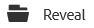
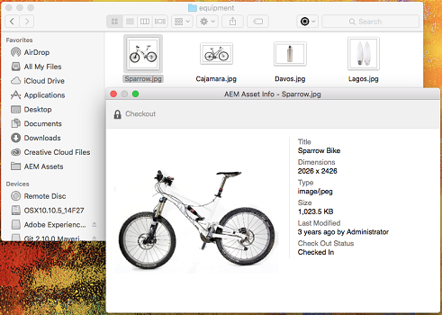
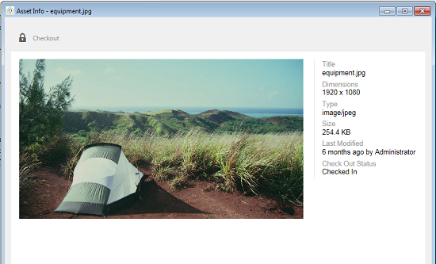
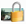
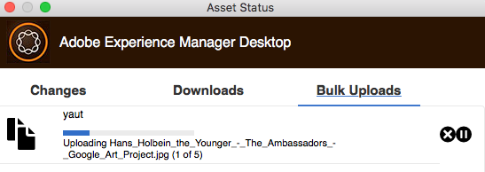

# Uso [!DNL Experience Manager] aplicativo de desktop v1.10 {#use-aem-desktop-app-v1x}

Ao usar o aplicativo, os ativos em [!DNL Experience Manager] são facilmente acessíveis no desktop local e podem ser usados em qualquer aplicativo de desktop. Os ativos podem ser facilmente revelados no Mac Finder ou no Windows Explorer, abertos em aplicativos de desktop e alterados localmente — as alterações são salvas novamente no [!DNL Experience Manager] com uma nova versão criada no repositório.

Essa integração permite que várias funções na organização gerenciem os ativos de maneira central nos Ativos e acessem-nos no Creative Cloud e em outros aplicativos, facilitando a adesão aos vários padrões, incluindo identidade visual.

As principais tarefas que você faz usando o [!DNL Experience Manager] o aplicativo de desktop v1 inclui:

1. [Conectar-se com um [!DNL Experience Manager] server](#installandconnect)
1. [Abrir ativos diretamente no desktop](#openondesktop)
1. [Editar e fazer check-out de ativos do desktop](#workonassets)
1. [Fazer upload de ativos e pastas em massa](#bulkupload)

Para os vários dos e não dos recomendados, consulte [práticas recomendadas para usar o aplicativo](best-practices-for-v1.md). Se você enfrentar problemas ao usar o aplicativo, consulte como [solução de problemas [!DNL Experience Manager] desktop](troubleshoot-app-v1.md).

>[!NOTE]
>
>O aplicativo de desktop foi introduzido em [!DNL Experience Manager] versão 6.1 e foi chamada [!DNL Experience Manager Assets Companion App].

## [!DNL Experience Manager] pontos de contato do aplicativo de desktop no fluxo de trabalho criativo {#aem-desktop-app-touch-points-in-the-creative-workflow}

[!DNL Experience Manager] aplicativo de desktop, juntamente com [!DNL Assets], integra-se ao seu fluxo de trabalho criativo e oferece os seguintes pontos de contato.

![[!DNL Experience Manager] pontos de contato do aplicativo de desktop para o fluxo de trabalho criativo](assets/aem_desktopapp_workflow.png)

[!DNL Experience Manager] pontos de contato do aplicativo de desktop para o fluxo de trabalho criativo

## Instalar e conectar o aplicativo ao [!DNL Experience Manager] server {#installandconnect}

Antes de começar a criar ou editar os ativos criativos, conecte o aplicativo de desktop com o [!DNL Assets] servidor para baixar e fazer upload de ativos no repositório. Execute as seguintes tarefas:

1. [Instale o aplicativo](#installapp).
1. [Definir suas preferências](#inapppref) e detalhes da conexão.
1. [Conectar-se a um [!DNL Experience Manager] server](#connect) e montar o repositório de ativos como unidade local.
1. [Ativar ações da área de trabalho](#desktopactions) em [!DNL Experience Manager] servidor.

[!DNL Experience Manager] O aplicativo de desktop usa uma conexão HTTPS para se conectar a [!DNL Experience Manager] para transferir seus ativos de maneira robusta e segura.

>[!NOTE]
>
>Para parte ou todas as etapas de instalação e configuração, talvez você precise da ajuda de seu [!DNL Experience Manager] administrador ou administrador do sistema.

### Instalar o aplicativo {#installapp}

Para usar [!DNL Experience Manager] aplicativo de desktop, verifique se [!DNL Experience Manager] A versão do servidor é compatível com o aplicativo. Baixe o arquivo de instalação apropriado (binário) para seu sistema operacional (Mac ou Windows) e instale o aplicativo.

A configuração detalhada pode ser necessária, dependendo das preferências da rede e do sistema. Consulte [Instalar e configurar [!DNL Experience Manager] aplicativo de desktop](install-configure-app-v1.md) para obter mais detalhes.

1. Vá para a [[!DNL Experience Manager] página de download do aplicativo de desktop v1.10](/help/using/release-notes-of-v1.md) e baixe o binário apropriado para seu sistema operacional.
1. Inicie o arquivo de instalação baixado e siga as instruções na tela para instalar o aplicativo.

   >[!NOTE]
   >
   >Somente uma instância do [!DNL Experience Manager] o aplicativo de desktop pode ser instalado e estar ativo de cada vez.

### Entender as opções e preferências no aplicativo {#inapppref}

O aplicativo permite que as configurações se conectem e desconectem do [!DNL Experience Manager] servidores, exibir status de uploads, gerenciar cache local e assim por diante. As configurações padrão funcionam para um usuário típico do aplicativo. É possível ajustar as configurações para obter mais do aplicativo e da integração com o [!DNL Experience Manager] servidor. As várias configurações são descritas abaixo em detalhes.

**Explorar ativos** Abra a unidade local na qual o [!DNL Assets] repositório está montado. Em outras palavras, explore os ativos que agora são disponibilizados em seu computador local.

**Exibir status do ativo** Quando os ativos alterados são carregados ou novos ativos são adicionados ao [!DNL Assets] repositório, o aplicativo fará upload dos ativos em segundo plano. O upload em segundo plano permite operações tranquilas, sem que seja necessário esperar a conclusão do upload, especialmente para ativos de grande porte. Você pode salvar suas alterações localmente e esquecê-las. O aplicativo leva algum tempo para enviar esses ativos ao servidor, dependendo da largura de banda disponível. Você pode verificar o status do upload, juntamente com algumas informações mais básicas.

**Opções** Clique nas opções da bandeja de aplicativos da área de trabalho para acessar as configurações e iniciar o aplicativo quando o sistema for iniciado; para conectar-se à [!DNL Experience Manager] servidor quando o aplicativo é iniciado; e para alterar a letra da unidade local onde [!DNL Assets] está disponível após a montagem.

**Avançado > Gerenciar cache** Você pode controlar a quantidade de espaço em disco disponibilizada para fins de armazenamento em cache local. Os artefatos do [!DNL Assets] são armazenados em cache localmente para obter uma experiência mais suave. Você pode alterar os padrões para atender às suas necessidades. Além disso, é possível limpar o cache para buscar todos os ativos novamente. Quando você limpa o cache, ele preserva as alterações não salvas. Todos os ativos não foram verificados [!DNL Experience Manager] servidor são retidos e não são excluídos.

### Conectar-se a um [!DNL Experience Manager] server {#connect}

O aplicativo oferece suporte à configuração de proxy no Mac e no Windows. A configuração é lida quando o aplicativo é iniciado. Se você modificar as configurações de proxy, reinicie o aplicativo para que as alterações entrem em vigor.

>[!NOTE]
>
>Se você modificar as configurações de proxy, reinicie o aplicativo para que as alterações entrem em vigor. Caso contrário, o aplicativo continuará a usar o servidor proxy configurado anteriormente.

1. Launch [!DNL Experience Manager] aplicativo de desktop. Para mapear seus [!DNL Experience Manager] com o aplicativo, especifique o seu [!DNL Experience Manager] servidor no formato `https://[aem-server-url]:[port]`.

   ![Autentique no Mac e forneça [!DNL Experience Manager] URL do servidor](assets/aem_desktop_app_server_url.png)

1. Na tela de logon, especifique o nome de usuário e a senha da instância. Para especificar uma alternativa [!DNL Experience Manager] , selecione a **[!UICONTROL Alternate Login URL]** opção.

   ![Fornecer [!DNL Experience Manager] credenciais do servidor na tela de logon em [!DNL Experience Manager] aplicativo de desktop](assets/login_screen_v1.png)

### Ativar ações do desktop no [!DNL Experience Manager] interface da web {#desktopactions}

Na interface do usuário do Assets, você pode explorar os locais dos ativos ou fazer check-out e abrir o ativo para edição no aplicativo de desktop. Essas opções são chamadas de ações do desktop e não são ativadas por padrão. Siga estas etapas para ativá-lo.

1. Na interface do Assets, clique/toque no ícone Usuário no canto superior direito da barra de ferramentas.
1. Clique em **[!UICONTROL My Preferences]** para exibir o **[!UICONTROL Preferences]** diálogo.

   ![[!DNL Experience Manager] interface com preferências do usuário](assets/aem_ui_user_preferences.png)

1. No [!UICONTROL User Preferences] , selecione **[!UICONTROL Show Desktop Actions For Assets]** e, em seguida, clique em **[!UICONTROL Accept]**.

   ![Marcar [!UICONTROL Show Desktop Actions For Assets] para ativar ações no desktop](assets/enable_desktop_actions.png)

   *Figura: Verificar [!UICONTROL Show Desktop Actions For Assets] para ativar as ações no desktop.*

## Acessar e abrir ativos no desktop {#openondesktop}

Ao clicar em **Abertura** para abrir um ativo no computador local, o aplicativo baixa o ativo para o cache interno. O aplicativo inicia o aplicativo de desktop nativo associado ao tipo de arquivo do ativo baixado.

No Mac, selecione **Abertura** no menu de contexto para abrir um ativo por meio de [!DNL Experience Manager] aplicativo de desktop. No Windows, selecione Abrir na Web no menu de contexto para abrir o ativo. Na janela Status do ativo, clique/toque em  para abrir o ativo.

Para arquivos Adobe InDesign (INDD), selecione **[!UICONTROL Open]** no menu de contexto. Ao clicar nessa opção, o aplicativo baixa os ativos vinculados para o sistema de arquivos local e abre o arquivo INDD no Adobe InDesign. Esse método garante que os ativos necessários estejam disponíveis localmente ao editar o arquivo INDD.

![Opções do menu de contexto para acessar e abrir ativos usando [!DNL Experience Manager] aplicativo de desktop](assets/aem_desktopapp_mac_context_menu.png)

*Figura: Opções do menu de contexto para acessar e abrir ativos usando [!DNL Experience Manager] aplicativo de desktop.*

>[!NOTE]
>
>No Windows, a variável [configuração padrão do Windows 7](https://support.microsoft.com/pt-BR/kb/2668751) impede [!DNL Experience Manager] aplicativos de desktop manipulem ativos maiores que 50 MB.

<!-- TBD: The above note is for Windows 7 which is not supported by the app anymore. Remove it later.
-->

>[!NOTE]
>
>A Adobe recomenda que você vá para Opções de exibição do localizador no Mac e desative as opções **Mostrar informações do item**, **Mostrar pré-visualização do item**, e **Mostrar coluna de visualização** para o montado [!DNL Assets] pasta. Isso melhora o desempenho.

### Opções adicionais no [!DNL Experience Manager] interface {#additional-options-in-aem-assets}

Depois de mapear o [!DNL Assets] na unidade local, você pode ativar ícones adicionais e o recurso Carregamento de pasta para serem exibidos nos ativos e pastas mapeados.

1. Abra o [!DNL Assets] e passe o mouse sobre uma pasta ou um ativo, para exibir as ações da área de trabalho como ações rápidas na exibição de Cartão.

   

   *Figura: na interface do usuário do Assets, abra o menu de ações rápidas para ver as ações da área de trabalho.*

   Essas ações da área de trabalho também estão disponíveis quando você clica no **Ações da área de trabalho** opção na barra de ferramentas depois de selecionar o ativo ou na barra de ferramentas na página ativo.

1. Para abrir o ativo no aplicativo de desktop associado à extensão de arquivo específica, clique no link **Abrir no desktop** ação rápida .

   Como alternativa, escolha **Abertura** do **Ações da área de trabalho** na barra de ferramentas.

Para localizar o ativo específico no sistema de arquivos local, clique em **Revelar** ação rápida . Como alternativa, escolha **Revelar** do **Ações da área de trabalho** na barra de ferramentas.

## Entender os status do ativo {#understand-the-asset-statuses}

|  | O aplicativo está conectado ao servidor e todos os ativos são sincronizados. |
--- |--- |
|  | O aplicativo é iniciado, mas não está conectado ao servidor. Alguns ativos podem ter a sincronização pendente. |
|  | Os ativos estão sendo sincronizados. Os arquivos estão sendo carregados ou baixados. Você pode ver os status exatos e pausar as transferências a partir da janela Status do ativo. |
|  | O aplicativo está tentando se reconectar. Possivelmente, os problemas de rede estão fazendo com que ele se desconecte. |

## Trabalhe seus ativos {#workonassets}

### Fazer check-out dos ativos do [!DNL Experience Manager] interface da web {#check-out-assets-from-the-aem-web-interface}

[!DNL Assets] O permite fazer check-out de ativos para edição e check-in depois que você concluir as alterações. Depois de fazer check-out de um ativo, somente você pode editar, anotar, publicar, mover ou excluir o ativo. Fazer o check-out de um ativo bloqueia o ativo e impede que outros usuários executem qualquer uma dessas operações. Para fazer check-out/check-in de ativos, é necessário ter acesso de gravação a eles.

Há duas maneiras de fazer check-out dos ativos do [!DNL Experience Manager] Web. Para obter informações detalhadas sobre o primeiro método, consulte [fazer check-in e check-out de arquivos da interface do usuário do Assets](https://experienceleague.adobe.com/docs/experience-manager-65/assets/managing/check-out-and-submit-assets.html). Siga estas etapas para que os segundos métodos façam check-out e abram o ativo quando [!DNL Experience Manager] aplicativo de desktop instalado.

1. Abra o [!DNL Assets] e passe o mouse sobre uma pasta ou um ativo, para exibir as ações da área de trabalho como ações rápidas na exibição de Cartão.

   

   Essas ações da área de trabalho também estão disponíveis quando você clica/toque no ícone Ações da área de trabalho na barra de ferramentas após selecionar o ativo ou na barra de ferramentas na página Ativo.

1. Para abrir o ativo, clique/toque na ação rápida Abrir no desktop .

   Como alternativa, escolha Abrir no menu Ações da Área de Trabalho na barra de ferramentas.

   >[!NOTE]
   >
   >Ao editar um arquivo que acabou de ser aberto e não foi retirado, outros usuários não sabem que um ativo está sendo atualizado por você.

1. Para abrir um ativo para edição em um aplicativo do Adobe Creative Cloud, clique/toque na ação rápida Editar desktop . Isso também faz o check-out do ativo para edição. Depois de concluir a edição, faça check-in do ativo para atualizar as alterações no [!DNL Assets].

   Como alternativa, escolha Editar no menu Ações da Área de Trabalho, na barra de ferramentas.

1. Selecione a opção de menu Abrir. Os ativos selecionados são abertos no modo de visualização.
1. Para editar os ativos, selecione a opção Editar. Os ativos são abertos no modo de edição.

### Confira os ativos do Localizador no sistema operacional Mac {#check-out-assets-on-mac}

O aplicativo permite que você faça check-out dos arquivos de ativos para impedir que outros usuários modifiquem os arquivos em que você está trabalhando.

1. No menu de contexto do Mac, selecione a opção Abrir pasta do AEM Assets para abrir o Localizador.

   ![Opções do menu de contexto para acessar e abrir ativos usando [!DNL Experience Manager] aplicativo de desktop](assets/aem_desktopapp_mac_context_menu.png)

   *Figura: Opções do menu de contexto para acessar e abrir ativos usando [!DNL Experience Manager] aplicativo de desktop.*

1. Navegue até o ativo do qual deseja fazer check-out.
1. Clique com o botão direito do mouse no ativo e selecione Mais informações de ativos no menu de contexto.
1. Na caixa de diálogo Informações do ativo, clique/toque no ícone Check-out para fazer check-out do ativo. O ícone Check-out é alternado para o ícone de check-in depois de clicar/tocar nele.

   

1. Para fazer o check-in do ativo para que ele fique disponível para outros usuários, clique/toque no ícone de check-in na caixa de diálogo Informações do ativo.

### Fazer check-out de ativos no Windows {#check-out-assets-on-windows}

O aplicativo permite que você faça check-out dos arquivos de ativos para impedir que outros usuários modifiquem os arquivos em que você está trabalhando.

1. No menu Contexto, selecione Explorar ativos para abrir o Explorer.
1. No Explorer, navegue até o local do ativo do qual deseja fazer check-out.
1. Clique com o botão direito do mouse no ativo e selecione Abrir na Web no menu de contexto.
1. Na caixa de diálogo Informações do ativo, clique/toque no ícone Check-out. O ícone Check-out alterna para o ícone Check-in.

   

1. Revise o ativo no Explorer. O ícone de bloqueio no ativo  indica que você fez check-out do ativo.

   >[!NOTE]
   >
   >O ícone de bloqueio pode aparecer após algum atraso. [!DNL Experience Manager] o aplicativo de desktop armazena os ativos em cache para acesso rápido, portanto, pode levar alguns minutos para atualizar o status bloqueado.

1. Para fazer o check-in do ativo para que ele fique disponível para outros usuários, clique/toque no ícone de check-in na **Informações do ativo** diálogo.

### Fazer check-in de um ativo usando o Finder ou o Explorer e usando a interface da Web {#check-in-an-asset-using-finder-or-explorer-and-using-web-interface}

Quando terminar de editar os ativos, salve-os no aplicativo de desktop. No menu de contexto, selecione **Mais informações de ativos** e clique em check-in.

Os ativos são carregados no [!DNL Experience Manager] servidor. Como opção, verifique o status do upload selecionando **Exibir status do ativo** no ícone da bandeja do sistema. Como alternativa, você pode fazer check-in de um ativo da [!DNL Experience Manager] Web. Clique nos ativos com check-out ou selecione-os. Na barra de ferramentas, clique no ícone de check-in .

Um ativo é carregado para [!DNL Experience Manager] automaticamente depois que qualquer alteração for salva localmente. O check-in disponibiliza o ativo para outros [!DNL Experience Manager] usuários para edição.

### Fazer upload de ativos e pastas em massa para o [!DNL Experience Manager] server {#bulkupload}

Usar [!DNL Experience Manager] aplicativo de desktop, você pode fazer upload de uma pasta inteira contendo ativos do seu diretório de arquivos local para [!DNL Assets]. Dessa forma, todos os ativos na pasta são carregados em massa em vez de ter que carregá-los um de cada vez.

1. Na interface do usuário do Assets, clique/toque **Criar** na barra de ferramentas e, em seguida, escolha **Carregar pasta** no menu.
1. Navegue até a pasta que deseja fazer upload e selecione-a.
1. Clique/toque em OK. A caixa de diálogo Status do ativo exibe o status do upload.

   

   Ver o status do upload na janela Status do ativo

   >[!NOTE]
   >
   >Você pode pausar ou cancelar manualmente o upload clicando/tocando no ícone apropriado.

1. Depois que a pasta for carregada, feche a caixa de diálogo e navegue até a interface do usuário do Assets. A pasta carregada é exibida na interface da Web.

O Adobe não recomenda copiar e colar ou arrastar um número maior de arquivos ou pastas aninhadas, do sistema de arquivos local, para a área de compartilhamento de rede. O aplicativo não pode controlar o processo de carregamento devido a limitações técnicas e o desempenho é insatisfatório.

Como alternativa, selecione os arquivos/pastas para os quais deseja fazer upload [!DNL Experience Manager] no Localizador ou no Explorer, copie-os para a área de transferência do sistema, navegue até a pasta de destino na área de compartilhamento de rede e, na [!DNL Experience Manager] seleção do menu de contexto do aplicativo de desktop **Colar ativos**. Por aqui, [!DNL Experience Manager] o aplicativo de desktop inicia o upload dos ativos colados de forma semelhante à **Carregar pasta** opção disponível no [!DNL Experience Manager] Web.

>[!MORELIKETHIS]
>
>* [Solução de problemas [!DNL Experience Manager] aplicativo de desktop](troubleshoot-app-v1.md)
